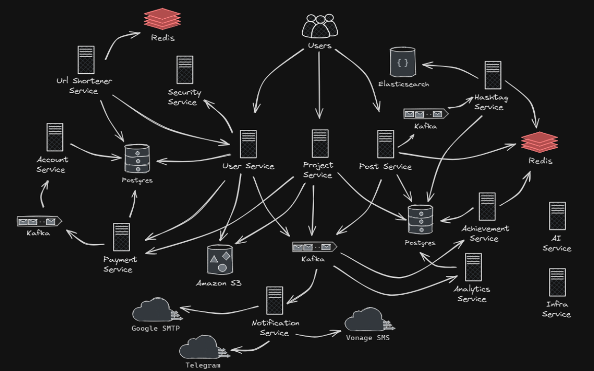

# 🧩 ABC Network

Это единый центр, объединяющий все сервисы системы в одном месте. Здесь можно найти архитектуру, ссылки на репозитории и инструкции по запуску.
Также, в каждом сервисе есть свой README.md, где можно найти более подробную информацию о его работе.

---

## 🗺️ Архитектура

- Message Queue: Kafka
- Базы данных: PostgreSQL, Redis, Elasticsearch

---

## 📦 Сервисы

| Сервис                | Назначение                          | Репозиторий                                                                | Главная ветка        |
|-----------------------|-------------------------------------|----------------------------------------------------------------------------|----------------------|
| User Service          | Работа с пользователями             | [user_service](https://github.com/yom-yoom/user_service)                   | Yom-stream9          |
| Post Service          | Работа с постами и лентой новостей  | [post_service](https://github.com/yom-yoom/post_service)                   | Yom-master-stream9   |
| Url Shortener Service | Работа со ссылками пользователей    | [url_shortener_service](https://github.com/yom-yoom/url_shortener_service) | Yom-master-stream9   |
| Project Service       | Работа с проектами                  | [project_service](https://github.com/yom-yoom/project_service)             | Yom-stream9          |
| Hashtag Service       | Работа с хэш-тегами постов          | [hashtag_service](https://github.com/yom-yoom/hashtag_service)             | Yom-master-stream9   |
| Account Service       | Работа с аккаунтами                 | [account_service](https://github.com/yom-yoom/account_service)             | Yom-stream9          |
| Payment Service       | Работа с оплатой                    | [payment_service](https://github.com/yom-yoom/payment_service)             | Yom-stream9          |
| Notification Service  | Работа с нотификациями              | [notification_service](https://github.com/yom-yoom/notification_service)   | Yom-stream9          |
| Achievement Service   | Работа с достижениями               | [achievement_service](https://github.com/yom-yoom/achievement_service)     | Yom-stream9          |
| Analytics Service     | Работа с аналитикой                 | [analytics_service](https://github.com/yom-yoom/analytics_service)         | Yom-stream9          |
| Security Service      | Обеспечение безопасности            | [security_service](https://github.com/yom-yoom/security_service)           | Yom                  |
| AI Service            | Внедрение искусственного интеллекта | [AI_service](https://github.com/yom-yoom/AI_service)                       | Yom                  |
| Infra Service         | Общие файлы и настройки             | [infra_service](https://github.com/yom-yoom/infra_service)                 | Yom-stream9          |

---

## ⚙️ Запуск всей системы

1. Клонировать желаемые репозитории-сервисы
2. Запустить infra_service
3. Перейти на главную ветку указанную в блоке Сервисы
4. Запустить файл run.sh (создает докер-контейнеры с необходимыми базами данных (необходим установленный и запущенный Docker))
5. Запустить контейнеры, если не были запущены автоматически в интерфейсе Docker Desktop или через консоль
6. Запустить сервисы в указанных ветках в блоке Сервисы
